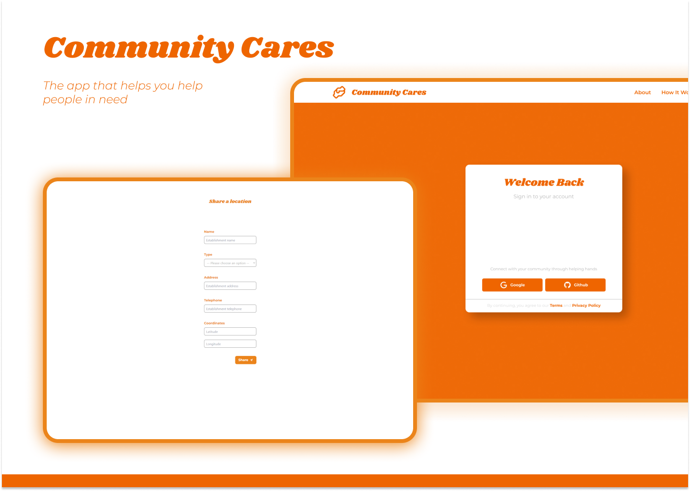

**👨‍💻 Tecnologias / Technologies**

Esse projeto foi desenvolvido com as seguintes tecnologias / This project was developed with the following technologies:

- [Typescript](https://www.typescriptlang.org/)
- [Axios](https://axios-http.com/)
- [Vitest](https://vitest.dev/)
- [Testing Library](https://testing-library.com)
- [Next.js](https://nextjs.org/)
- [Zod](https://zod.dev/)
- [React Hook Form](https://react-hook-form.com/)
- [Tailwind CSS](https://tailwindcss.com/)

-----------------------------------------------------------------------------------------------------------------------------------------------------------------------------------

**💻 Projeto / Project**

Community Cares is an app that helps people find free giveaway food locations to help people in need 🧡

-----------------------------------------------------------------------------------------------------------------------------------------------------------------------------------

**🚀 Como executar / How to run**

- Clone o repositório / Clone the repository 

- Instale as dependências com `npm i` / Install the dependencies with `npm i`
- Inicie o servidor com `npm run dev` / Start the server with `npm run dev`

-----------------------------------------------------------------------------------------------------------------------------------------------------------------------------------

**🧑🏾‍💻 Autor / Author**

**Matheus Gomes de Souza**

LinkedIn: https://www.linkedin.com/in/matheus-gomes-de-souza/  
E-mail: matheusg_souza@outlook.com
